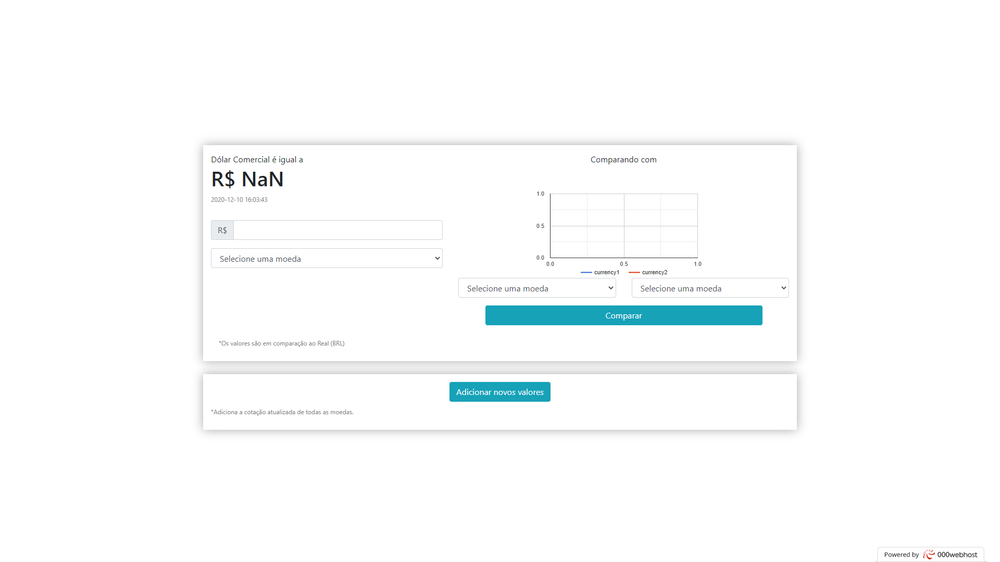

<h1> Graph </h1>
O Graph é uma ferramenta que permite que o usuário compare a cotação de duas moedas, em relação ao Real <b>(BRL)</b>, por meio de um gráfico. Também pode ser usado como um conversor de Real <b>(BRL)</b> para qualquer uma das treze (13) moedas fornecidas pela API de Cotações de Moedas, disponível em <a href="https://docs.awesomeapi.com.br/api-de-moedas">AwesomeAPI</a>

<h2> Meta </h2>
Luiz Henrique Medeiros dos Santos – <a href="https://www.instagram.com/luhmeiy/">@luhmeiy</a>
