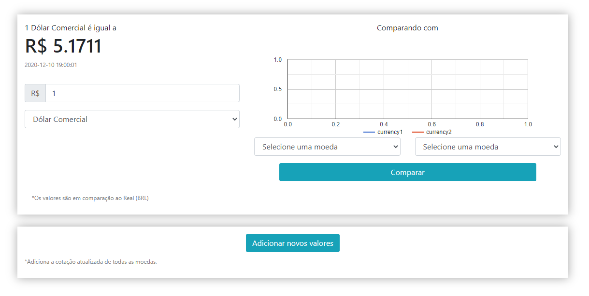

<h1> Graph </h1>
O Graph é uma ferramenta que permite que o usuário compare a cotação de duas moedas, em relação ao Real <b>(BRL)</b>, por meio de um gráfico. Também pode ser usado como um conversor de qualquer uma das treze (13) moedas fornecidas pela API de Cotações de Moedas, disponível em <a href="https://docs.awesomeapi.com.br/api-de-moedas">AwesomeAPI</a>, para Real <b>(BRL)</b>.

<h2> Como usar? </h2>
Com uma interface simples, o Graph conta com um conversor de moedas para Real <b>(BRL)</b>. Nesse conversor, o usuário seleciona entre uma das treze (13) moedas disponíveis, e então digita no campo acima quantas moedas deseja calcular. O site exibirá o resultado automáticamente.
Ao lado, basta selecionar uma moeda em cada um dos dois campos, clicar no botão "Comparar", e o Graph exibira uma comparação entre o preço das duas.
Abaixo da interface principal, há um anexo com o botão "Adicionar novos valores". Clicando nesse botão, o Graph puxará a cotação mais atualizada de todas as moedas disponibilizadas pela API de Cotações de Moedas.
<h2> Meta </h2>
Luiz Henrique Medeiros dos Santos – <a href="https://www.instagram.com/luhmeiy/">@luhmeiy</a>
